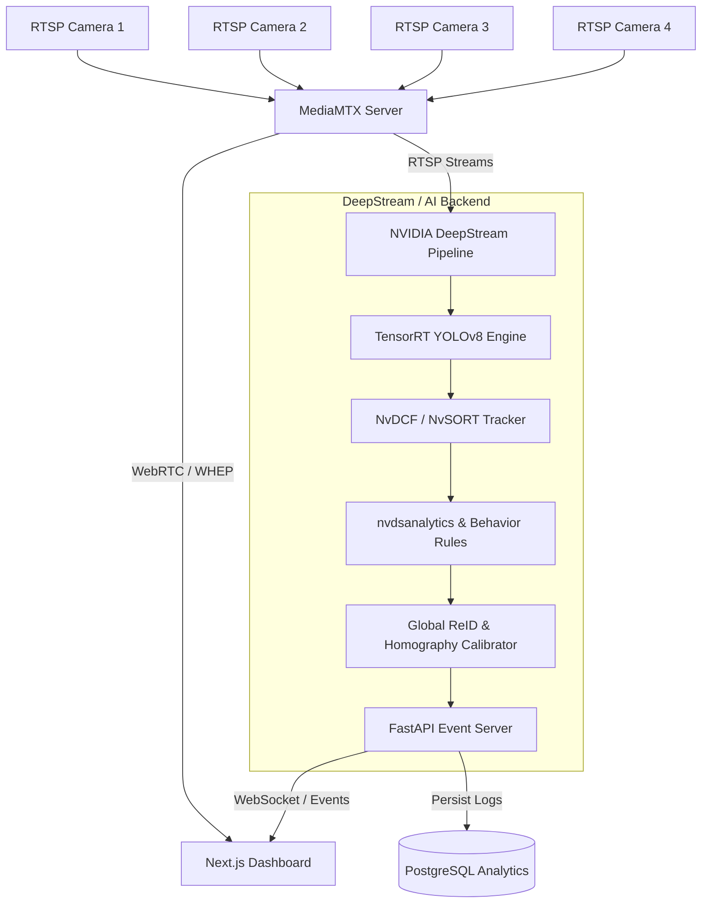

# 🚀 DeepStream SDK with 4-Camera Tracking & Multi-Target Re-ID

An enterprise-grade, real-time multi-camera intelligent video analytics (IVA) system built on **NVIDIA DeepStream SDK**, **TensorRT YOLOv8**, and **Next.js 14 Web Dashboard**.

Designed for smart warehouse surveillance, autonomous robot tracking, and security monitoring with sub-100ms ultra-low latency WebRTC streaming and 2D floor-plan spatial projection.

---

## 🌟 Key Features

- **Multi-Camera Tracking (MTMC)**: Synchronous ingestion of up to 4 RTSP camera streams with unified spatial coordinate calibration.
- **DeepStream + TensorRT Acceleration**: High-throughput GPU inference with custom YOLO parsing plugin (`nvdsparsebbox_Yolo`).
- **Global Re-ID & Spatial Fusion**: Fuses local single-camera tracks into unique cross-camera Global IDs via 2D Homography calibration, Hungarian assignment, and cosine feature matching.
- **Behavior Analytics & ROI Safety Rules**:
  - **Intrusion & Area Overlap**: Configurable polygon zones with temporal hysteresis noise filtering (`CARFULL` / `EMPTY`).
  - **Virtual Tripwire**: Directional line-crossing counters (`IN` / `OUT`) with trajectory interpolation.
  - **Loitering & Dwell Time**: Threshold-based loitering alerts and crowd density estimation.
- **Ultra-Low Latency Streaming**: MediaMTX WebRTC & WHEP/WHIP pipeline for sub-second live preview in web browsers.
- **Modern Web Dashboard**: Next.js 14 (App Router), TailwindCSS, dark mode, multi-view camera matrix, 2D floor plan overlay, and AI Copilot chatbot (RAG via ChromaDB).

---

## 🏗️ System Architecture



---

## 📂 Repository Structure

```
├── backend/                  # FastAPI backend, DeepStream pipelines & AI core
│   ├── core/                 # RTSP reader, Homography calibrator, Re-ID, Intrusion logic
│   ├── models_config/        # DeepStream YOLO configs, weights, and custom CUDA parsers
│   ├── utils/                # Healthcheck, circular loggers, and diagnostics
│   └── main.py               # Main FastAPI entrypoint with WebSocket broadcast
├── web-dashboard/            # Next.js 14 web application
│   ├── app/                  # App Router pages (Monitor, Analytics, Building, Calibration)
│   ├── components/           # UI components, WebRTC player, 2D floor map, AI chat
│   └── lib/                  # TypeScript types, i18n localization, and utilities
├── services/
│   └── mediamtx/             # MediaMTX configuration for RTSP/WebRTC proxying
├── docs/                     # Architecture diagrams and specifications
└── docker-compose.yml        # Multi-container deployment orchestrator
```

---

## ⚡ Quick Start

### 1. Prerequisites
- **NVIDIA GPU** (Turing, Ampere, Ada, or newer with CUDA 12+)
- **NVIDIA Container Toolkit** installed
- **Docker & Docker Compose**

### 2. Environment Setup
```bash
# Clone repository
git clone https://github.com/duchoang206/Deepstream-SDK-with-4-camera-tracking.git
cd Deepstream-SDK-with-4-camera-tracking

# Configure environment
cp .env.example .env 2>/dev/null || true
```

### 3. Launch with Docker Compose
```bash
docker compose up -d --build
```

Access the dashboard:
- **Web Dashboard**: `http://localhost:3000`
- **FastAPI Documentation**: `http://localhost:8000/docs`
- **MediaMTX WebRTC Stream**: `http://localhost:8889`

---

## 📡 API & WebSocket Specification

| Endpoint | Protocol | Description |
| :--- | :--- | :--- |
| `/api/cameras` | GET / POST | Manage active RTSP camera sources |
| `/api/calibration` | GET / POST | Homography 2D matrix calibration |
| `/api/rules` | GET / POST | Intrusion, tripwire, and dwell rules |
| `/api/health` | GET | System GPU/CPU metrics and pipeline latency |
| `/ws/stream` | WebSocket | Real-time tracking bboxes, Re-ID IDs, and alert events |

---

## 📄 License

Distributed under the MIT License. See `LICENSE` for more information.
