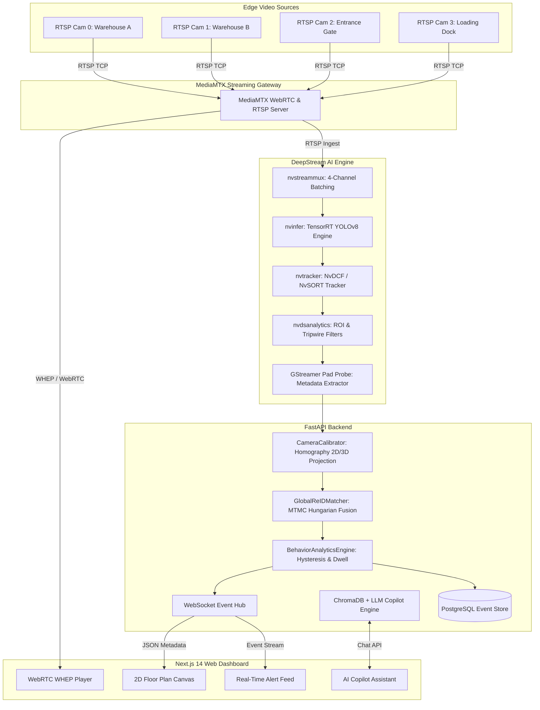

# 📐 System Architecture & Data Flow Specification

This document details the software architecture, pipeline flow, and data routing for the **DeepStream SDK 4-Camera Tracking & Multi-Target Re-ID System**.

---

## 1. High-Level Architecture Overview

The system operates across three primary layers:
1. **Video Ingestion & Hardware-Accelerated Video Analytics (IVA)**: NVIDIA DeepStream SDK with custom TensorRT YOLOv8 CUDA parsers.
2. **Multi-Target Multi-Camera (MTMC) Fusion & Event Engine**: FastAPI backend managing homography spatial projections, Re-ID tracking, and behavior analytics.
3. **Ultra-Low Latency Streaming & Web Client**: MediaMTX WebRTC gateway providing sub-100ms video feeds to the Next.js 14 React Dashboard.



---

## 2. GStreamer DeepStream Pipeline Topology

Each camera stream is processed concurrently within a batched DeepStream GStreamer pipeline:

```
[ rtspsrc (Cam 0..3) ]
       │
       ▼
[ rtph264depay / rtph265depay ]
       │
       ▼
[ nvv4l2decoder (NVDEC Hardware Decoder) ]
       │
       ▼
[ nvstreammux (Batch size: 4, 1920x1080) ]
       │
       ▼
[ nvinfer (Custom YOLOv8 TensorRT Engine) ]
       │
       ▼
[ nvtracker (Multi-Object Tracker: NvDCF) ]
       │
       ▼
[ nvdsanalytics (Intrusion zones & line crossing) ]
       │
       ▼
[ nvvidconv -> CapsFilter -> nvdsosd ]
       │
       ▼
[ GStreamer Pad Probe Metadata Callback ]
```

---

## 3. MTMC Re-ID Fusion & Homography Coordinate Space

### Spatial Calibration Formula
Pixel coordinates $(x_{cam}, y_{cam}, 1)^T$ from the bottom-center of the detected bounding box are projected into floor coordinates $(X_{floor}, Y_{floor})$ using the Direct Linear Transformation (DLT) Homography Matrix $H \in \mathbb{R}^{3 \times 3}$:

$$\begin{bmatrix} X' \\ Y' \\ Z' \end{bmatrix} = \mathbf{H} \begin{bmatrix} x_{cam} \\ y_{cam} \\ 1 \end{bmatrix}, \quad X_{floor} = \frac{X'}{Z'}, \quad Y_{floor} = \frac{Y'}{Z'}$$

### Cross-Camera Cost Function
The Hungarian global assignment cost between candidate gallery track $j$ and detection $i$ fuses visual cosine distance and physical floor Euclidean distance:

$$\text{Cost}(i, j) = \alpha \cdot (1 - \cos(\mathbf{f}_i, \mathbf{f}_j)) + (1 - \alpha) \cdot \frac{\|\mathbf{p}_i - \mathbf{p}_j\|_2}{D_{max}}$$

Where:
- $\mathbf{f}_i, \mathbf{f}_j$: L2-normalized visual Re-ID appearance vectors.
- $\mathbf{p}_i, \mathbf{p}_j$: Metric coordinates on the shared 2D floor plan.
- $D_{max} = 2.5\text{m}$: Maximum spatial association radius.
- $\alpha = 0.6$: Weight balancing visual vs. spatial proximity.

---

## 4. Temporal Hysteresis Filter for ROI Noise Elimination

To eliminate flicker caused by temporary occlusion or single-frame detection drops:
- **`CARFULL` Transition**: Requires $\ge 5$ consecutive frames with object overlap above threshold.
- **`EMPTY` Transition**: Requires $\ge 8$ consecutive frames without object overlap.

---

## 5. Security and Network Ports

| Port | Protocol | Service | Description |
| :--- | :--- | :--- | :--- |
| `3000` | HTTP / TCP | Next.js Frontend | Web Dashboard UI |
| `8000` | HTTP / WS | FastAPI Backend | REST API & WebSocket metadata stream |
| `8554` | RTSP / TCP | MediaMTX | RTSP stream ingestion & proxy |
| `8081` | HTTP / TCP | MediaMTX | WebRTC WHEP / WHIP signaling |
| `18189`| UDP / TCP | MediaMTX | WebRTC ICE candidate negotiation |
| `5432` | TCP | PostgreSQL | Persistent analytics & event log database |
